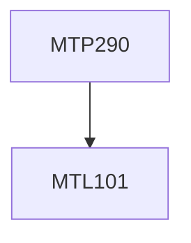

**Credits:** 2 (0-0-4)

**Prerequisites:** [[/Mathematics/MTL101|MTL101]]

#### Description
Programming concepts. Implementation of matrix operations, Complexity in Matrix Operations, Implementation of linear algebraic solvers; solution of systems of linear equations. Gauss elimination, LU decomposition and Iterative methods. Implementation of several Numerical Integration algorithms, Initial value problems and Boundary Value Problems for ODEs.

### Prerequisite Tree

