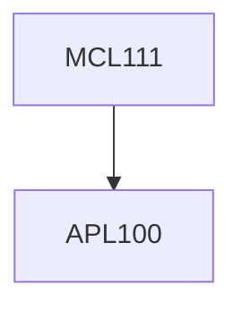

**Credits:** 4 (3-0-2)

**Prerequisites:** [[/Applied Mechanics/APL100|APL100]]

#### Description
Kinematic pairs, Kinematic diagram and inversions. Mobility and range of movements. Displacement, velocity and acceleration analysis of planar linkages, graphical and analytical methods. Dimensional synthesis for motion, function and path generation. Force analysis of planar mechanisms. Cam profile synthesis, graphical and analytical method. Gear tooth profile, interference in gears. Gear types, gear trains including compound epicyclic gears. Design of flywheel and governors. Inertia forces and their balancing for rotating and reciprocating machines.

Free and forced vibration of SDOF system. Introduction to 2 DOF systems, vibration absorbers.

### Prerequisite Tree

