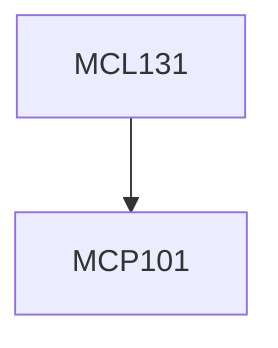

**Credits:** 3 (3-0-0)

**Prerequisites:** [[/Mechanical Engineering/MCP101|MCP101]]

**Overlaps with:** three core courses of ME2 (30% each)

#### Description
CASTING: Sand casting, Gating system and its design, Riser design and its placement, Melting, Pouring and Fluidity, Solidification of pure metals and alloys, Casting defects, Inspection and testing. Other casting processes, advantages and applications.

WELDING: Shielded metal arc welding, other arc welding processes like TIG, MIG and SAW processes, Types of metal transfer in arc welding, Gas welding and Gas cutting, Resistance welding, Solid state welding processes, Brazing, Soldering and their applications, Surfacing and its applications.

FORMING: Plastic deformation of metals, stress-strain relationships, Yield criteria, Hot working and Cold working, Friction and lubrication in metal working, Analysis of bulk forming and sheet metal forming processes. Unconventional forming processes.

Powder : Powder production methods, compaction and sintering. Applications of powder metallurgy.

### Prerequisite Tree

