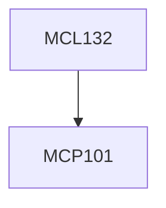

**Credits:** 3 (3-0-0)

**Prerequisites:** [[/Mechanical Engineering/MCP101|MCP101]]

**Overlaps with:** 30% with MCL131

#### Description
Mechanical behaviour of metals and alloys in plastic deformation, Stress-strain relationships, Yield criteria, Fundamentals of plasticity, Tensile properties, Flow stress and flow curves, Fundamentals of metal forming processes, Strain rate and temperature in metal working, Hot working, Cold working and annealing, Analysis of forming processes like forging, rolling, extrusion, wire drawing and sheet metal forming by slab method, Equipment and tools used in metal forming operations, Types of presses, different types of dies and their design aspects, Unconventional forming processes.

### Prerequisite Tree

