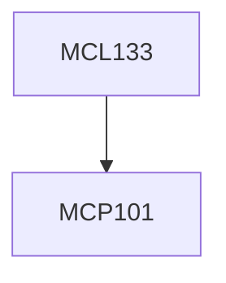

**Credits:** 3 (3-0-0)

**Prerequisites:** [[/Mechanical Engineering/MCP101|MCP101]]

#### Description
Introduction and fundamentals of Casting of complicated shapes: automotive components, casting of light alloys – Aluminum, Magnesium and Titanium alloys.

Injection moulding: Thermoplastics, thermoset plastics and composites – processing methodologies.

Powder Metallurgy: fabrication routes, powder size determination – micro and nano level, powder consolidation routes, compacting, sintering, hot pressing, sintering, hot iso static pressing, field assisted sintering technologies.

Advances in near net shape manufacturing: Metal Injection moulding, Laser engineered net shaping.

### Prerequisite Tree

