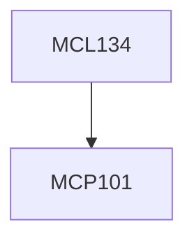

**Credits:** 3.5 (3-0-1)

**Prerequisites:** [[/Mechanical Engineering/MCP101|MCP101]]

**Overlaps with:** MCL231

#### Description
Introduction to Metrology and its relevance, standardization, dimensional measurement, limits, fits and tolerances, limit gauging, linear and angular measurements and their applications, surface roughness-quantification & measurement, Feature Inspection, Online inspection, Calibration.

Introduction to Quality Assurance and Quality Control, Various elements in Quality Assurance, On-line and Off-line quality control, Statistical concepts in quality, Central limit theorem, Quality Characteristics, QC Tools. Process capability studies, Remedial / Corrective actions.

Design of sampling plans, Economics of product inspection, Quality costs, Problems and illustrations in Quality Assurance.

### Prerequisite Tree

