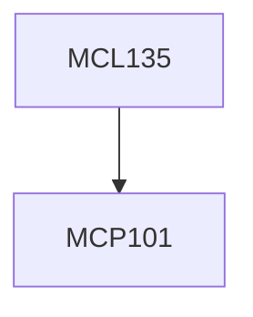

**Credits:** 3 (3-0-0)

**Prerequisites:** [[/Mechanical Engineering/MCP101|MCP101]]

#### Description
Principles of arc welding, basic physics of arc and flame, Gas welding and Gas cutting, manual metal arc welding, GTAW, GMAW. Metal transfer mechanisms in arc welding, Weld bead characterization, Electrogas and electroslag welding, Resistance welding, Heat flow characteristics and metallurgical changes in fusion welding, Solid state welding processes, Radiant energy welding processes, Brazing, Soldering and their applications, Joint design, welding symbols and Joint evaluation through destructive and non destructive testing methods, welding defects, causes and remedies, residual stress and distortion. Plasma cutting, surfacing and plasma spray forming, surfacing applications. Advances in welding.

### Prerequisite Tree

