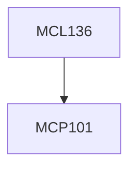

**Credits:** 3 (3-0-0)

**Prerequisites:** [[/Mechanical Engineering/MCP101|MCP101]]

#### Description
Introduction to various material removal processes, Nomenclature and geometry of cutting tools, Mechanics of Conventional and Non Conventional Machining including force, temperature, surface integrity. Methods of measurement of forces, temperature and surface finish (experimentally and analytically), Tool wear mechanisms and tool life criteria, Basic concepts of cost and economics of machining.

Various types of machine tools and their structures, Workholding and tool holding devices for machine tools.

Ultraprecision machining and grinding methods and the machine tools used for such processes. Manufacturing of micro tools, Nano-finishing of materials using advanced machining methods.

### Prerequisite Tree

