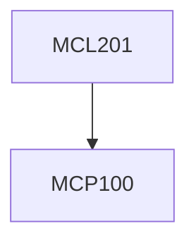

**Credits:** 3.5 (2-0-3)

**Prerequisites:** [[/Mechanical Engineering/MCP100|MCP100]]

#### Description
Introduction to generation of drawings as a design process for machine assembly. Use of datum planes to locate features and machine elements uniquely in assemblies.

Sectioning, dimensioning, notes and version control in drawings. Standardized representation of threads, fasteners, welds, bearings, springs and related components.

Introduction to limits, fits and tolerances, dimensional and geometric tolerances, surface finish symbols.

Generation of assembly drawings including sectioning and bill of materials.

Evolving details of components from assembly considerations. Detailing of components involving shafts, bearing, pulleys, gears, belts, brackets for assembly.

Solid modeling of above assembly and incorporating assembly constraints for animation of motion of machine assemblies.

### Prerequisite Tree

