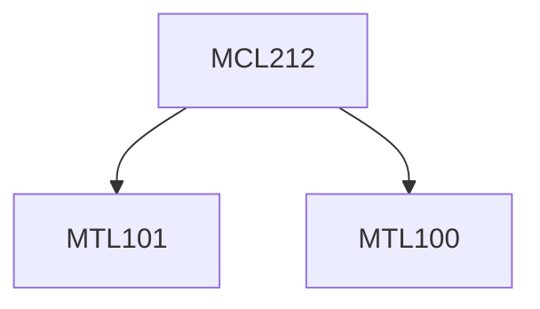

**Credits:** 4 (3-0-2)

**Prerequisites:** [[/Mathematics/MTL100|MTL100]], [[/Mathematics/MTL101|MTL101]]

**Overlaps with:** 50-60% with ELL225 and CLL261

#### Description
Introduction; Fourier and Laplace transforms; Mathematical Modeling of simple physical systems; Transfer function; Block diagrams; Signal flow graph; Transient response analysis using Laplace transform; Frequency response; Design / performance specifications in time and frequency domain; Steady state error and error constants;

Proportional, integral, derivative, PD and PID control; Sensors and actuators for temperature, pressure, flow and motion control systems; Realization of standard controllers using hydraulic, pneumatic, electronic, electro-hydraulic and electro-pneumatic systems;

Stability; Routh’s criterion; Nyquist stability criterion, Bode plots; Control system design using Root Locus and Frequency response; Lead and lag compensation; Gain margin, Phase margin; Introduction to Modern control: State space representation; Control with state feedback; Review of applications of control in: Machine tools, Aerospace, Boiler, Engine Governing, Active vibration control.

### Prerequisite Tree

