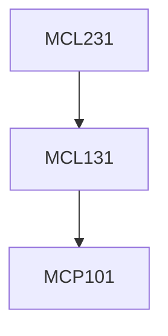

**Credits:** 3 (3-0-0)

**Prerequisites:** [[/Mechanical Engineering/MCL131|MCL131]]

**Overlaps with:** MCL134, MCL136

#### Description
Introduction to Metal Machining and Machine Tools, Geometry of cutting tools, Mechanics of Machining including force and temperature generation, Methods of measurement of forces and temperature (experimentally and analytically), Tool wear mechanisms and tool life criteria, Basic concepts of cost and economics of machining.

Various types of machine tools and their development with regard to productivity & accuracy requirements, Workholding and tool holding devices for machine tools.

Introduction to non-conventional machining processes and understanding basic mechanisms of material removal in such processes Introduction to metrology, Dimensional Inspection, Inspection by measurement, Limit gauging, Design of Limit gauges, Surface quality inspection, Feature inspection.

### Prerequisite Tree

