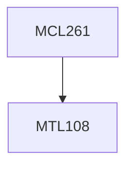

**Credits:** 3 (3-0-0)

**Prerequisites:** [[/Mathematics/MTL108|MTL108]]

#### Description
Introduction to Modeling, Linear Programming - Formulation, Solution methods including Simplex, Primal-Dual, Integer Programming- Formulation, Solution methods, Introduction to Dynamic Programming, Software Tools and Case Studies.

### Prerequisite Tree

