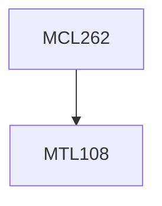

**Credits:** 3 (3-0-0)

**Prerequisites:** [[/Mathematics/MTL108|MTL108]]

#### Description
Overview of Probability Basics, Introduction to Discrete Time Markov Chains (DTMC), Transient and Limiting analysis of DTMC, Introduction to Continuous Time Markov Chains (CTMC), Transient and Limiting analysis of DTMC, Applications, Discrete Event Simulation - Introduction, Generation of Random Variables, Simulation modeling through case studies.

### Prerequisite Tree

