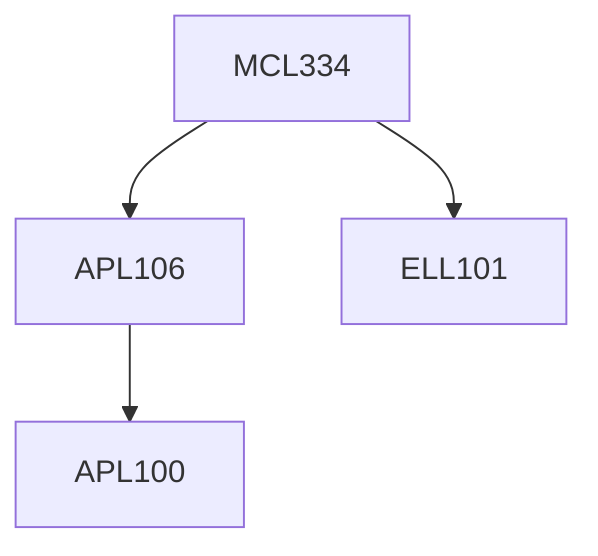

**Credits:** 4 (3-0-2)

**Prerequisites:** [[/Electrical Engineering/ELL101 | ELL101]] and [[/Applied Mechanics/APL106 | APL106]] or [[/Mechanical Engineering/MCL141 | MCL141]]

**Overlaps with:** 5% with MEL312

#### Description 
Introduction to Automation technologies, applications around us and in manufacturing. Types of systems - mechanical, electrical, electronics; Sensors, Factory Automation Sensors, Electrical sensors, Process Automation Sensors and their interfaces; Hydraulics & Pneumatic Systems and components; Circuit design approach and examples; Sequence operation of more than two cylinders and motors; Electro Pneumatic & Electro Hydraulic Systems, Relay Logic circuits, Feedback control systems; Programmable Logic Controllers, programming languages & instruction set, ladder logic, functional blocks, structured text, and applications. Human Machine Interface & SCADA; Motion controller, stepper & servo motors, multi axes coordinated motion, CNC control; RFID technology and its application; Machine vision and control applications.

Laboratory work will be hands-on design and operation of automatic systems.

### Prerequisite Tree

