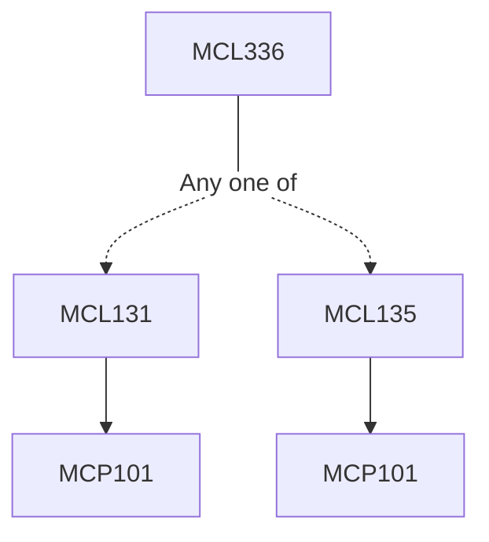

**Credits:** 4 (3-0-2)

**Prerequisites:** [[/Mechanical Engineering/MCL131|MCL131]] or [[/Mechanical Engineering/MCL135|MCL135]]

#### Description
Introduction to joining technology, General survey and classification of Welding processes, importance of advanced materials and joining technologies, welding technologies related to industries: automotive, aerospace, nuclear, oil and gas industries.

### Prerequisite Tree

