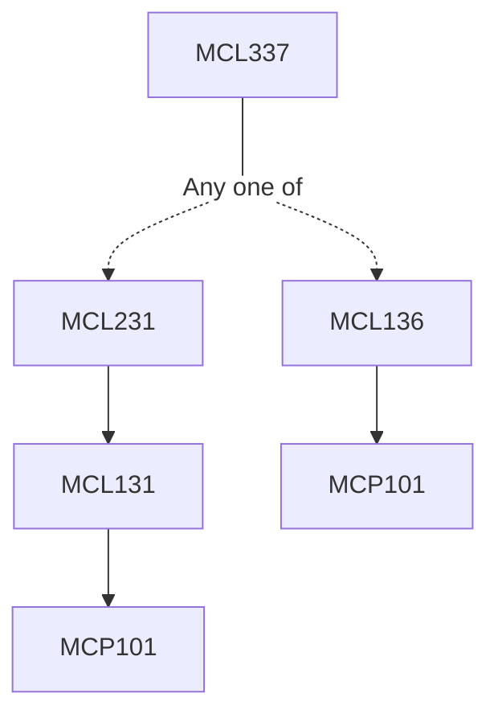

**Credits:** 3 (3-0-0)

**Prerequisites:** [[/Mechanical Engineering/MCL231|MCL231]] or [[/Mechanical Engineering/MCL136|MCL136]]

**Overlaps with:** ~20% overlap with MCL231 and MCL136 Introduction to advanced machining processes – need for such processes and application areas.

#### Description
Mechanical Energy utilized advanced machining processes like ultrasonic machining, abrasive flow machining, magnetic abrasive finishing, magneto-rheological finishing, abrasive water jet machining–mechanics of cutting, process parametric analysis, process capabilities, applications.

Thermoelectric based advanced machining processes like electro discharge machining, wire EDM, Plasma Arc Machining, Laser Beam Machining, Focussed Ion Beam Machining – working principles, material removal mechanisms, process capabilities and applications.

Electrochemical and Chemical Advanced Machining – ECG, Electrostream Drilling, Chemical Machining – process characteristics, numerical modelling of the processes, applications and limitations.

### Prerequisite Tree

