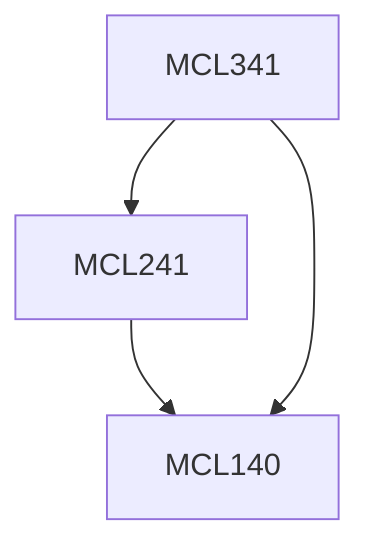

**Credits:** 4 (3-0-2)

**Prerequisites:** [[/Mechanical Engineering/MCL140|MCL140]] & [[/Mechanical Engineering/MCL241|MCL241]]

#### Description
Revision of fundamentals. Thermodynamics of compressible flow – wave motion in compressible medium, Mach number and cone, properties. Steady one-dimensional compressible flow through variable area ducts. Converging and converging-diverging nozzles and diffusers. Effects of heating and friction in duct flow, Rayleigh and Fanno lines. Flows with normal shocks. Oblique shocks and reflection. Expansion waves. Prandtl-Meyer flow. Flow over bodies. Measurements and applications. Jet propulsion – types of engines, propulsion fundamentals. Compressor, combustor and turbines construction and performance. Rocket propulsion – basics, solid and liquid propelled engines, parametric studies, construction features, single and multi-stage rockets. Thrust chamber and nozzle models. Studies of in-use engines. Environmental aspects.

### Prerequisite Tree

