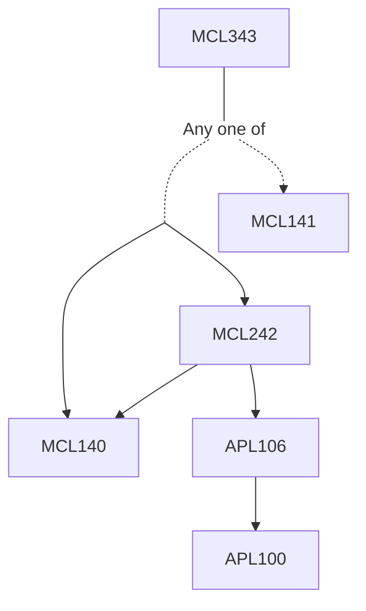

**Credits:** 3 (3-0-0)

**Prerequisites:** ([[/Mechanical Engineering/MCL140|MCL140]] and [[/Mechanical Engineering/MCL242|MCL242]]) or [[/Mechanical Engineering/MCL141|MCL141]]

#### Description
Introduction. Fuels: gaseous, liquid and solid. Physical and chemical characterizations. Chemical thermodynamics and kinetics. Conservation equations for multi-component systems. Premixed systems: laminar flame problems and effects of different variables. Measurement of flame speed. Flammability limits. Ignition and quenching. Turbulent premixed flames. Non-premixed systems: laminar diffusion flamejet, droplet burning. Combustion of solids: drying, devolatilization and char combustion. Biomass combustion devices. Coal combustion. Pollution: Main pollutants and their environmental impact. NOx, CO and SOx formation chemistry. Particulate pollutants. Emissions from engines, power plants and industrial applications. Low NOx burners and furnace design.

### Prerequisite Tree

