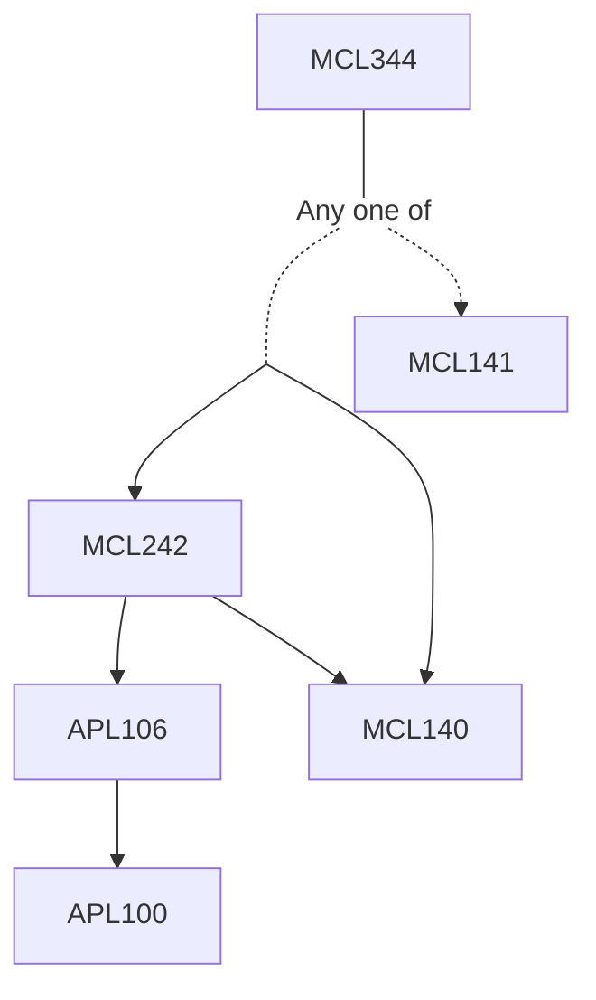

**Credits:** 4 (3-0-2)

**Prerequisites:** ([[/Mechanical Engineering/MCL140|MCL140]] and [[/Mechanical Engineering/MCL242|MCL242]]) or [[/Mechanical Engineering/MCL141|MCL141]]

**Overlaps with:** ESL850

#### Description
Introduction and applications, recapitulation of fundamentals. Vapor compression systems: Ideal and real cycle analyses, Refrigerants: designation, desirable properties, environmental considerations. Advanced vapor compression cycles. Components: condensers, evaporators, compressors and expansion devices – construction, operation and performance. Vapor absorption and gas cycle refrigeration. Psychrometry. Processes - heating, humidification, cooling and dehumidification etc. Air-conditioning calculations, Cooling load estimation.

### Prerequisite Tree

