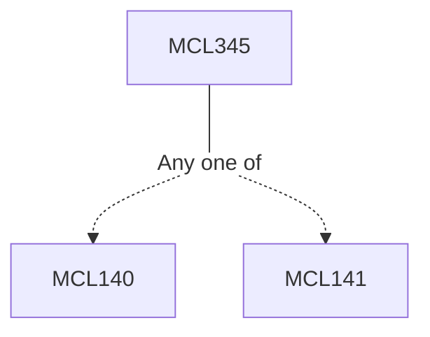

**Credits:** 4 (3-0-2)

**Prerequisites:** [[/Mechanical Engineering/MCL140|MCL140]] or [[/Mechanical Engineering/MCL141|MCL141]]

**Overlaps with:** <10% with PG I.C. Engine course

#### Description
Introduction, Engine design and operating parameters, Ideal properties, Models of engine processes and cycles, combustion thermodynamics, fuel/air cycle analysis, Spark-Ignition engine combustion, SI and Diesel engine emissions, IC Engines: the future.

### Prerequisite Tree

