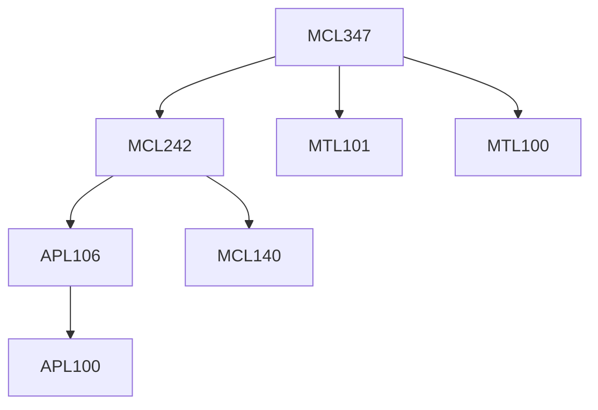

**Credits:** 3 (3-0-0)

**Prerequisites:** [[/Mathematics/MTL100 | MTL100]], [[/Mathematics/MTL101 | MTL101]], [[/Mechanical Engineering/MCL242 | MCL242]]

**Overlaps with:** MCL441 (~20%)

#### Description 
Heat conduction: Governing equation, Analytical solution of steady and unsteady 2D heat conduction, Heat transfer from convective radiative fins; Convection: Governing equations, Forced convection heat transfer, scale analysis, similarity solutions and momentum integral method for laminar flows, energy integral method for turbulent flows; Natural convection: similarity solutions and energy integral methods, mixed convection; Heat transfer from pipes: analytical solutions; Heat transfer at high speed; Radiative heat transfer: blackbody radiation, radiative heat transfer between gray, diffusive surfaces, radiative heat exchange between non-gray surfaces,gas radiation, enclosure theory, governing equation for radiatively participating medium. Boiling: pool boiling, development of a correlation for nucleate boiling, critical heat flux, flow boiling. Condensation: film condensation over flat and circular geometries, Nusselt theory.

### Prerequisite Tree

