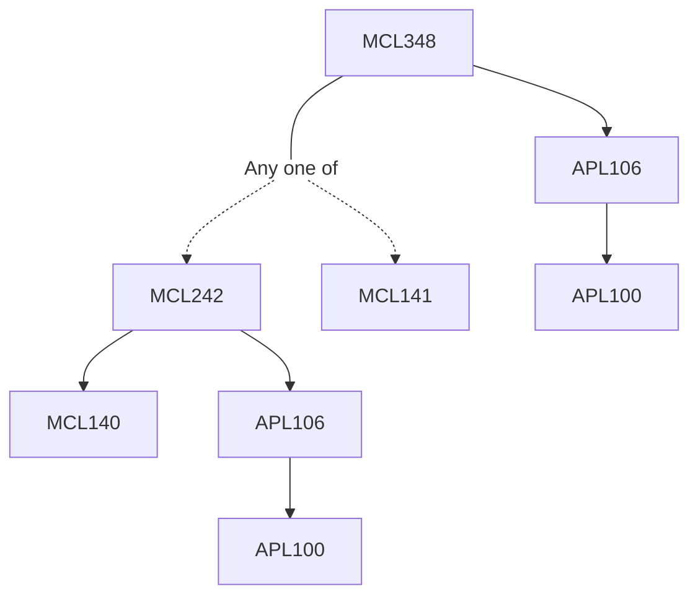

**Credits:** 3 (3-0-0)

**Prerequisites:** [[/Applied Mechanics/APL106 | APL106]] and ([[/Mechanical Engineering/MCL242 | MCL242]] or [[/Mechanical Engineering/MCL141 | MCL141]])

#### Description 
Electronics packaging and cooling technologies; Heat sinks: principle, types, modelling, and design; Contact resistance; Heat pipes and two phase systems: principle, types, modelling and design; Microchannel heat exchangers: single phase and two phase; Radiative heat transfer and importance in space applications; Thermoelectric devices; Measurement and characterisation techniques; Case studies of thermal management of electronics.

### Prerequisite Tree

