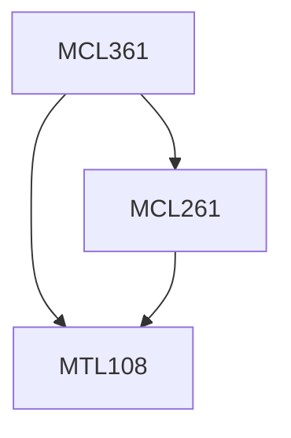

**Credits:** 3 (3-0-0)

**Prerequisites:** [[/Mathematics/MTL108|MTL108]], [[/Mechanical Engineering/MCL261|MCL261]]

#### Description
Manufacturing strategy, Manufacturing flexibility, Manufacturing complexity, Investment decisions using life cycle costing, System reliability and maintenance models, Economic design of quality control plans, Single and mixed model assembly line balancing, Shop floor scheduling algorithms, Lot sizing and inventory control models, Performance modeling of manufacturing systems, Production control mechanisms like Kanban, CONWIP and POL2.

### Prerequisite Tree

