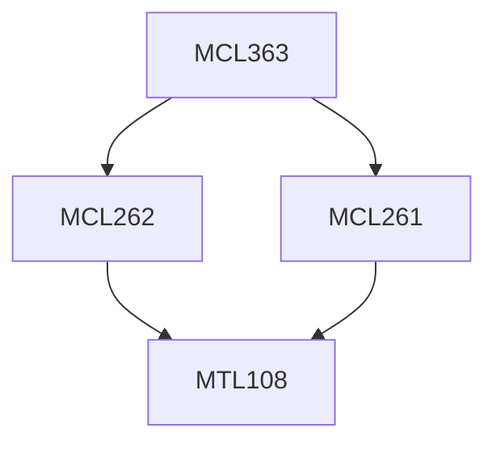

**Credits:** 3 (3-0-0)

**Prerequisites:** [[/Mechanical Engineering/MCL261|MCL261]] & [[/Mechanical Engineering/MCL262|MCL262]]

#### Description
Introduction to investment and rate of return, Markowitz theory and its applications to optimal portfolio management, Introduction to Bonds, Introduction to Derivatives and Options, Concept of Risk Neutral Pricing, Single period and multiple period binomial models for option pricing, Introduction to Black Scholes model and the formula.

### Prerequisite Tree

