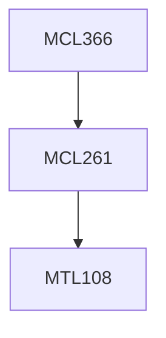

**Credits:** 3 (3-0-0)

**Prerequisites:** [[/Mechanical Engineering/MCL261|MCL261]]

#### Description
Mixed Integer Linear Programming, Markov Decision Processes, Applications of OR techniques to areas such as aviation security, resource allocation, energy policy, railways systems, management of natural resources, Public Service Delivery.

### Prerequisite Tree

