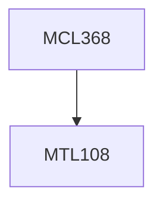

**Credits:** 3 (3-0-0)

**Prerequisites:** [[/Mathematics/MTL108|MTL108]]

#### Description
Process capability analysis, Process quality improvement approaches, Economics of quality control, Reliability data analysis, Component and system reliability models, Reliability test plans, Warranty analysis, Maintenance models.

### Prerequisite Tree

