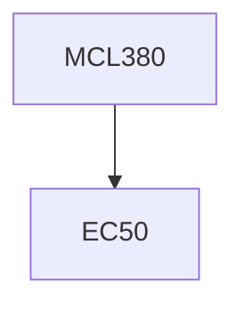

**Credits:** 3 (3-0-0)

**Prerequisites:** courses as specified by the instructor and EC 50 Course details shall be announced at the time of offering of the course. The assessment will be based on a combination of assignments, quizzes, and term paper and tests.

#### Description
No description available.

### Prerequisite Tree

