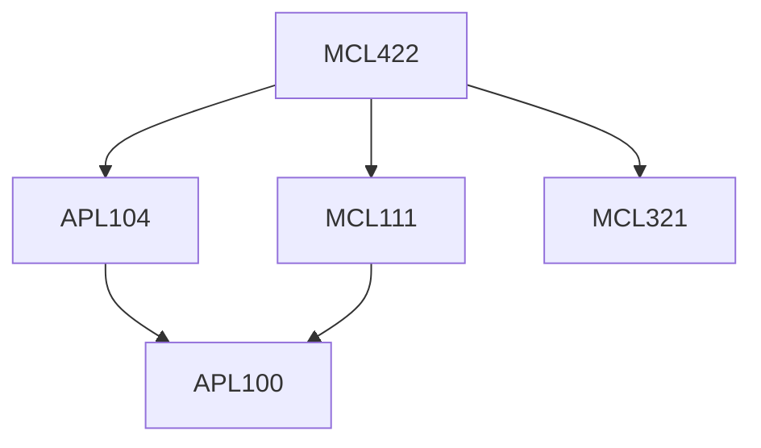

**Credits:** 3 (2-0-2)

**Prerequisites:** [[/Applied Mechanics/APL104 | APL104]], [[/Mechanical Engineering/MCL111 | MCL111]], [[/Mechanical Engineering/MCL321 | MCL321]]

#### Description 
Types of brakes, Friction materials in brakes and their characteristics, Design of brakes in passenger cars / vans: weight transfer, effect of tyre / road adhesion, wheel lock, brake efficiency / adhesion utilization; Design of brakes in vehicle – trailer combinations: in light trailers, overrun brakes, center axle trailer, chassis trailer; Brake- design analysis: Brake and shoe factors in different types of brakes, Comparison of estimation by analytical and FE methods; Thermal effects in friction brakes (thermal analysis and heat dissipation); Issues in electronic control of brakes: features of anti-lock brake system, Traction Control System, Electronic Stability Control, Adaptive Cruise Control, trailer Sway Control; Brake Noise: Sources, its analysis (using analytical and FE based approaches) and control.

### Prerequisite Tree

