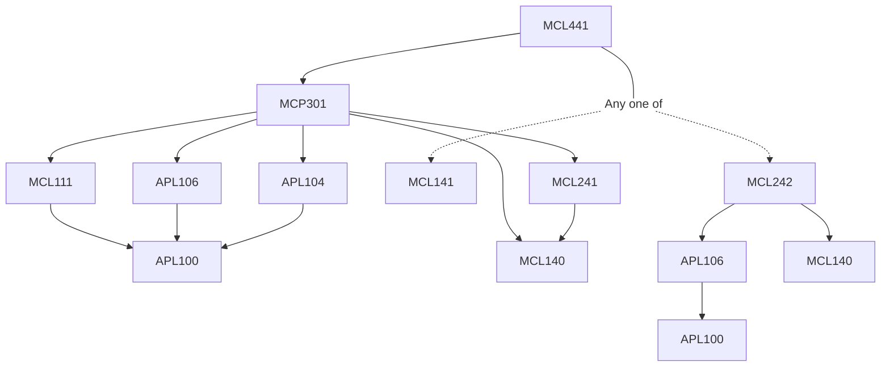

**Credits:** 4 (2-0-4)

**Prerequisites:** ([[/Mechanical Engineering/MCL242|MCL242]] or [[/Mechanical Engineering/MCL141|MCL141]]) and [[/Mechanical Engineering/MCP301|MCP301]]

#### Description
Modelling heat transfer phenomena,comparison with experimental data, assumptions and their implications. Mathematical modeling: dimensional analysis, scaling, physical similarity, self-similarity, physical laws and constitutive relations. Solution methodologies: separation of variables, self-similar solutions, boundary layer analysis. Results: representation and interpretation, uncertainty and error bands. Heat transfer experiments: design, uncertainty analysis, selection of geometrical and physical parameters, instrumentation, and rig calibration. Temperature, pressure and flow rate measurements. Systemic errors in temperature measurement: thermocouples and thermowell. Data acquisition systems: basics and applications. Data analysis and error estimation. Project-type work involving modeling, designing and performing experiments related to heat transfer applications.

### Prerequisite Tree

