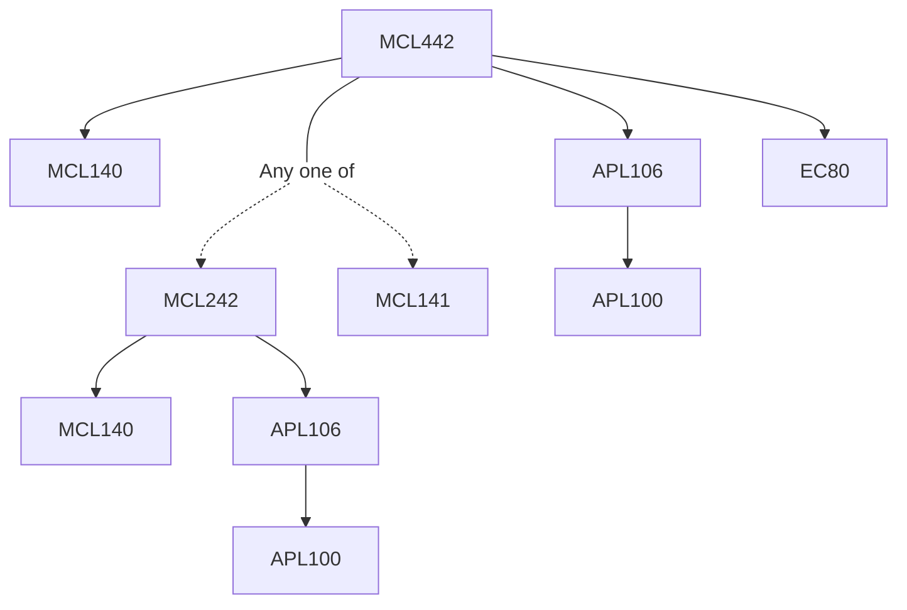

**Credits:** 3 (3-0-0)

**Prerequisites:** [[/Applied Mechanics/APL106 | APL106]] and [([[/Mechanical Engineering/MCL140 | MCL140]] & [[/Mechanical Engineering/MCL242 | MCL242]]) or [[/Mechanical Engineering/MCL141 | MCL141]]] and EC 80

#### Description 
Applications of fluid mechanics, heat transfer, and thermodynamics to biological processes,including blood flow in the circulatory system, heart function, effects of heating and cooling on cells, tissues, and proteins.

### Prerequisite Tree

