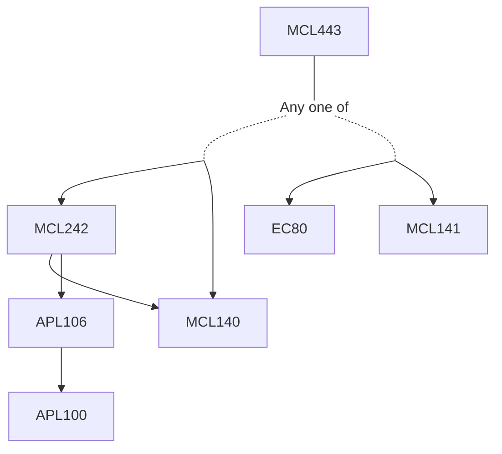

**Credits:** 3 (3-0-0)

**Prerequisites:** [[/Mechanical Engineering/MCL140 | MCL140]] & [[/Mechanical Engineering/MCL242 | MCL242]] or [[/Mechanical Engineering/MCL141 | MCL141]] and EC 80

**Overlaps with:** CLL722 (30%), CLL720 (10%), CLL721 (15%)

#### Description 
Introduction to electrochemical systems – electrochemical power sources, nomenclature, survey of common types. Thermodynamics – thermodynamic functions, chemical and electrochemical potentials, temperature dependence, activity dependence. Reaction kinetics – electrical double layer, kinetics, activation energy of reactions, current- voltage relationship, polarization and losses, charge transfer kinetics, performance criteria. Transport processes – infinitely dilute solutions, concentrated solutions, thermal effects, fluid mechanics. Modeling of electrochemical systems – governing equations, assumptions, boundary conditions of species and charge. Thermal management. Environmental impact.

### Prerequisite Tree

