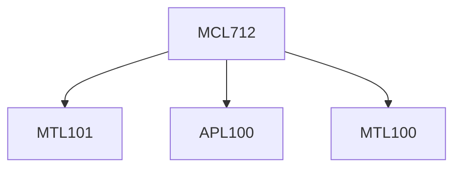

**Credits:** 3 (3-0-0)

**Prerequisites:** For ME1/ME2 and other UG students: [[/Applied Mechanics/APL100|APL100]], [[/Mathematics/MTL100|MTL100]], [[/Mathematics/MTL101|MTL101]]

#### Description
Acoustic wave equation; Sound propagation, absorption, reflection and transmission; Acoustical Transmission lines and filters; Analysis of mufflers using transmission matrices; Acoustics of cavities; acoustic modes; Modal density; frequency response; Response via modal analysis; Structural-acoustic cavities; weakly-coupled cavities Strongly-coupled cavities; coupled modes; Finite element analysis of interior acoustic problems; acoustic finite elements; coupling analysis; panel contribution analysis; Sound radiation from structures; infinite plates; finite plates; radiation efficiency; Rayleigh integral; Finite element analysis of Sound radiation problems; Concept of radiation modes; Basic idea of boundary element method and its application for Interior and radiation problems in acoustics; Aerodynamic noise; Inhomogeneous wave equation; Lighthill’s acoustic analogy; Introduction to statistical energy analysis.

### Prerequisite Tree

