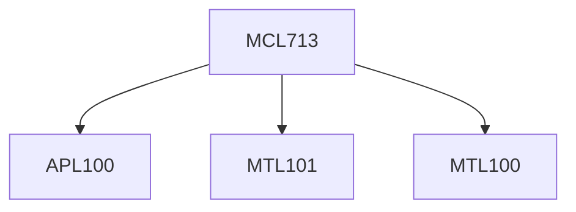

**Credits:** 3 (3-0-0)

**Prerequisites:** For ME1/ME2: [[/Applied Mechanics/APL100|APL100]], [[/Mathematics/MTL100|MTL100]], [[/Mathematics/MTL101|MTL101]]

#### Description
Acoustic wave equation; plane and spherical waves; Reflection and transmission; Passive control measures and their Limitations; Fourier series; Fourier Integral; Random processes; Laplace Transform; Optimal filtering; z-transform; FIR and IIR filters; Active control in ducts; mechanisms of cancellation; Single channel feedforward control of sound; LMS algorithm; Reference signals; FxLMS algorithm; Identification of secondary paths; Single channel feedback control; Active control of free field sound radiation; Global control of enclosed 3D sound fields; Local control of enclosed 3D sound fields; Diffused sound fields; Active control of sound in vibro-acoustic cavities; Active structural-acoustic control (ASAC); Feedforward, Feedback and optimal control; Multichannel feedforward control; Applications of active noise control; Implementation and demonstration of an experimental active noise control system.

### Prerequisite Tree

