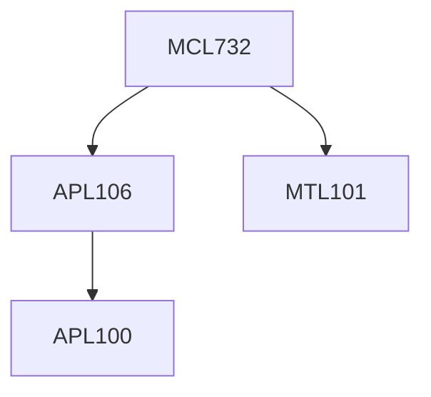

**Credits:** 3 (3-0-0)

**Prerequisites:** [[/Mathematics/MTL101 | MTL101]], [[/Applied Mechanics/APL106 | APL106]] for UG students

#### Description 
Air Pollution – Dominant pollution sources and the relevant emission physics, physicochemical characteristics and emission control. Application of multivariate statistical methods to air pollutant transport & source apportionment. Application to air pollution in Delhi-NCR.

### Prerequisite Tree

