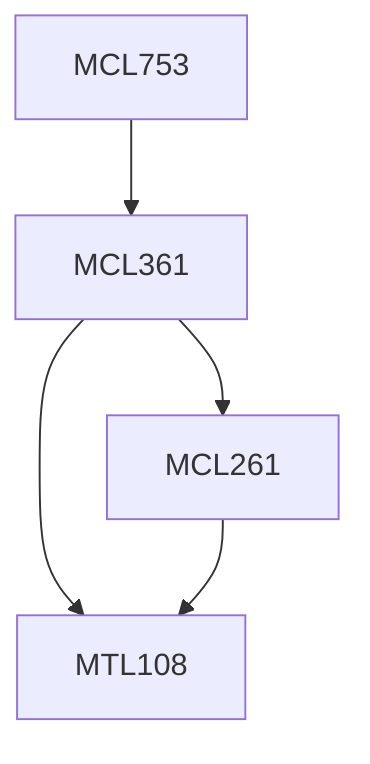

**Credits:** 4 (3-0-2)

**Prerequisites:** [[/Mechanical Engineering/MCL361|MCL361]]

#### Description
Introduction to manufacturing analytics (manufacturing analytics concepts, contemporary issues in high-value manufacturing, and opportunities provided by analytics and big data technologies), data types and applications (point of sale data, service touch point data, service centre data, warranty data, machine condition data, machine failure history, machine utilisation data, work in process data and online quality control data), optimisation of manufacturing processes (optimisation concepts, evolutionary computing, multi-objective optimisation, and applications of optimisation for sequential and assembly processes), and latest advancements in manufacturing analytics (virtual reality, augmented reality, and motion capture gaming technologies for manufacturing).

### Prerequisite Tree

