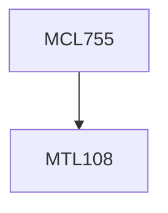

**Credits:** 3 (2-0-2)

**Prerequisites:** [[/Mathematics/MTL108|MTL108]]

#### Description
Need for servitization, Service system types, Key dimensions of service systems, Frameworks for service system design, tools for service system design, Value co-creation, Service quality models, Economics of service systems, Service contract design, CMMI-SVC model for service systems, Case studies on service system design.

### Prerequisite Tree

