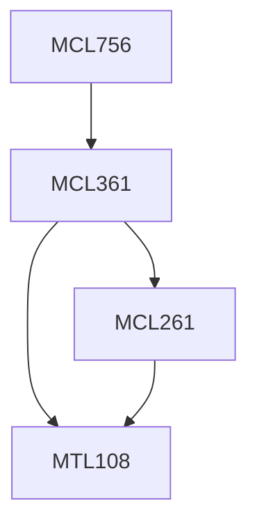

**Credits:** 3 (3-0-0)

**Prerequisites:** [[/Mechanical Engineering/MCL361|MCL361]]

#### Description
Supply Chain Orientation and Management, Various flows in a typical supply chain, Supply chain strategy – its context, components and structure, Location Decisions, Inventory Decisions, Information Decisions – Bull whip effect and its ramifications, remedies, Transportation Decisions - including planning techniques, Supply chain modeling and analysis, Performance measurement; Various frameworks including Balanced Score Card, SCOR etc., Customer Service level selection and supply chain vulnerabilities, Reverse Logistics and decision making involved, Supply chain integration and web enabled supply management.

### Prerequisite Tree

