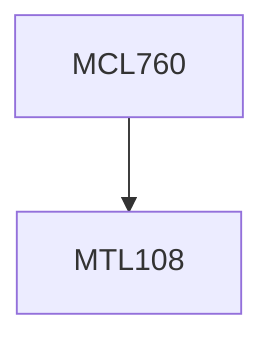

**Credits:** 3 (3-0-0)

**Prerequisites:** [[/Mathematics/MTL108|MTL108]]

#### Description
The nature of projects, the project as a non-repetitive unit production system, the project as an agent of change. Project Identification considering objectives and SWOT analysis, Screening of project ideas, Technical, Market, Financial, Socio-economic and Ecological Appraisal of a project. Work break down structure and network development. Basic Scheduling, Critical Path and four kinds of floats, Scheduling under probabilistic durations, Time Cost tradeoffs, Project Monitoring with PERT/Cost, Organizational aspects, Computer packages and project completion.

### Prerequisite Tree

