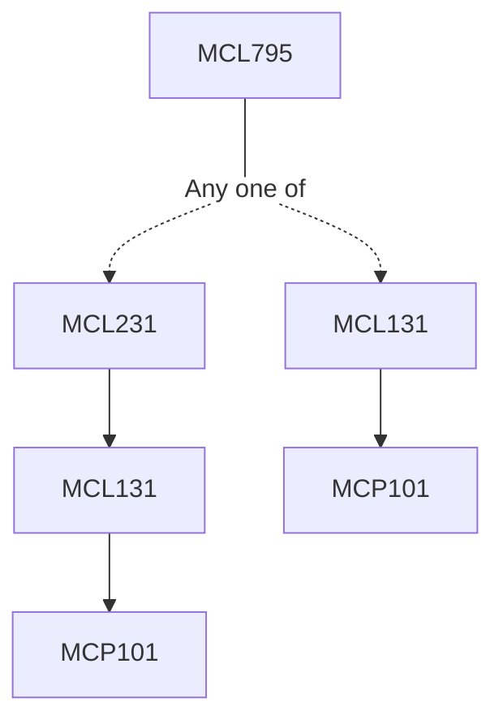

**Credits:** 4 (3-0-2)

**Prerequisites:** For UG students: [[/Mechanical Engineering/MCL231|MCL231]] or [[/Mechanical Engineering/MCL131|MCL131]]

#### Description
Sources and condition for generation of laser beam; Main industrial lasers and their characteristics; laser beam interaction with matter- CW, pulsed, ultrashort laser pulse; heat flow theory and metallurgical considerations; laser and laser assisted cutting; laser drilling; laser and laser assisted welding; laser transformation hardening; laser remelting; laser surface alloying and cladding; laser surface texturing; LCVD and LPVD; laser beam shaping and its application in laser surface modifications; Laser metal forming; laser shock peening;

Laser based additive manufacturing- fundamentals, key features, challenges and applications; Laser interaction with the metal powder; Security challenges in laser based additive manufacturing; Theoretical modelling of laser material processing; On-line process monitoring and control of laser-based material processing and its significance on mechanical and metallurgical properties; Economics of laser; Laser applications in other manufacturing and metrological processes (laser marking, laser cleaning etc.) and physics behind the process; laser safety; laser safety standards and safety procedures.

### Prerequisite Tree

