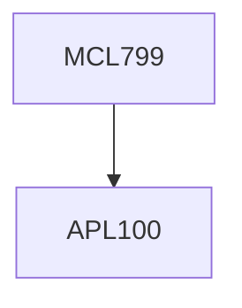

**Credits:** 3 (3-0-0)

**Prerequisites:** For UG: [[/Applied Mechanics/APL100|APL100]]: Engineering Mechanics; For 428PG: None

#### Description
Introduction to Kinematics; Rigid body kinematics-translations and rotations; Coordinate transformations; Newton-Euler equations of motion; Recursive techniques; Principle of virtual work and D’Alembert’s principle; Euler-Lagrange equations of motion; DeNOC based dynamic modelling; Trajectory planning; Forward and Inverse Dynamics; Transfer function and state-space representation of dynamical systems; Controllers (P, PD, PID); Phase portraits; Equilibrium points and their classification; Lyapunov stability; Non- linear trajectory control; Cartesian and force control.

### Prerequisite Tree

