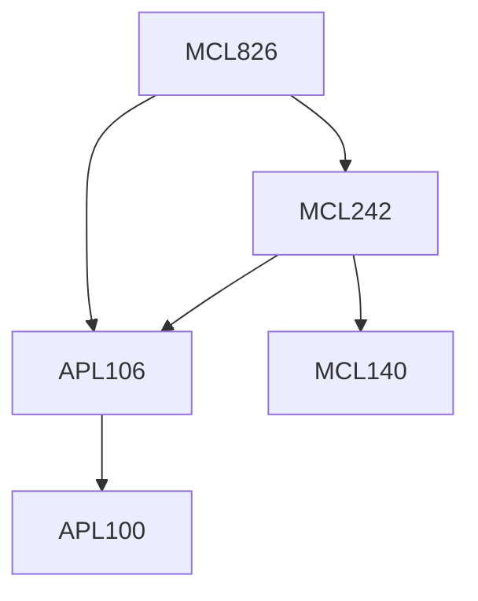

**Credits:** 4 (3-0-2)

**Prerequisites:** [[/Applied Mechanics/APL106 | APL106]] and [[/Mechanical Engineering/MCL242 | MCL242]] or their equivalents for UG students only

#### Description 
Micro-and nano-scale flow fundamentals: molecular basis of fluid mechanics and transport processes, scaling laws for microfluidics, microfabrication Flows with low inertia: flow past bodies, lubrication theory, Hele Shaw flows, steady/unsteady parallel flows Interfacial phenomena: wetting, capillary effects, super-hydrophobic surfaces, electro-wetting, thermo-/solute-capillary effects, hydrodynamic slippage in liquids, Internal flows in rarefied gas dynamics, Diffusion, unsteady convective mass transfer (Taylor-Aris dispersion), ion- transport in dilute solutions, absorption, mixing, thermal effects, electrical double layers and the Poisson-Boltzmann equation, Electrohydrodyanmics in dilute electrolyte solutions Electrokinetic transport phenomena: electro-osmosis and electrophoresis

### Prerequisite Tree

