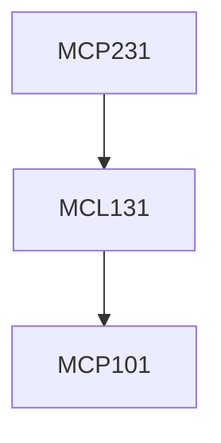

**Credits:** 1 (0-0-2)

**Prerequisites:** [[/Mechanical Engineering/MCL131|MCL131]]

**Overlaps with:** MCP232 (60%)

#### Description
Experiments on casting, joining, forming, injection molding and powder metallurgical processes.

### Prerequisite Tree

