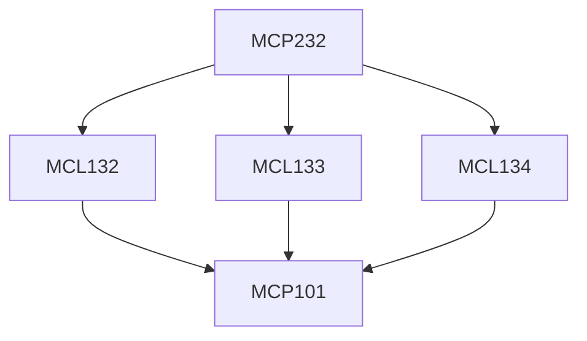

**Credits:** 1 (0-0-2)

**Prerequisites:** [[/Mechanical Engineering/MCL132 | MCL132]], [[/Mechanical Engineering/MCL133 | MCL133]], [[/Mechanical Engineering/MCL134 | MCL134]]

**Overlaps with:** MCP231 (60%)

#### Description 
Experiments on casting, forming, injection molding and powder metallurgical processes.

### Prerequisite Tree

