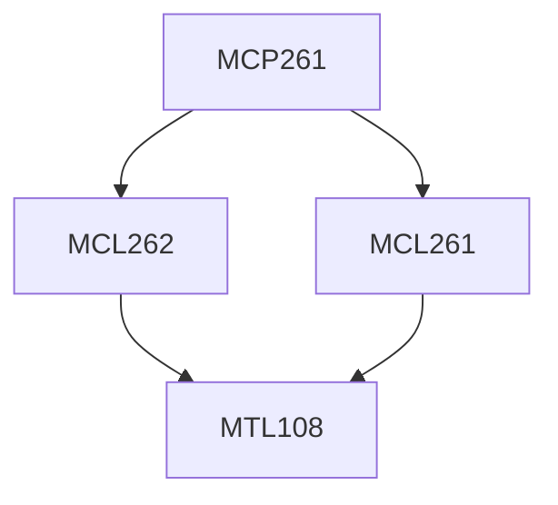

**Credits:** 1 (0-0-2)

**Prerequisites:** [[/Mechanical Engineering/MCL261|MCL261]], [[/Mechanical Engineering/MCL262|MCL262]]

#### Description
Deterministic optimization problem formulation, solution using CPLEX, sensitivity analysis; Conceptualization/Visualization of problem situation, formulation of simulation model, simulation runs and output analysis.

### Prerequisite Tree

