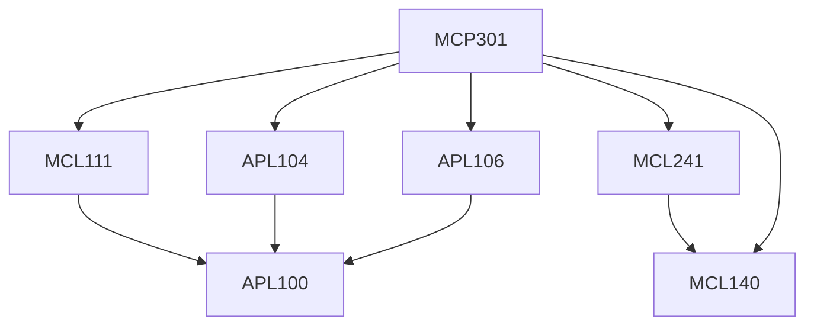

**Credits:** 1.5 (0-0-3)

**Prerequisites:** [[/Applied Mechanics/APL104|APL104]], [[/Applied Mechanics/APL106|APL106]], [[/Mechanical Engineering/MCL111|MCL111]], [[/Mechanical Engineering/MCL140|MCL140]], [[/Mechanical Engineering/MCL241|MCL241]]

#### Description
Experiments pertaining to applications of the concepts learnt in the theory courses of Fluid Mech, Solid Mech, Thermodynamics, Kinematics and dynamics and Energy Systems.

### Prerequisite Tree

