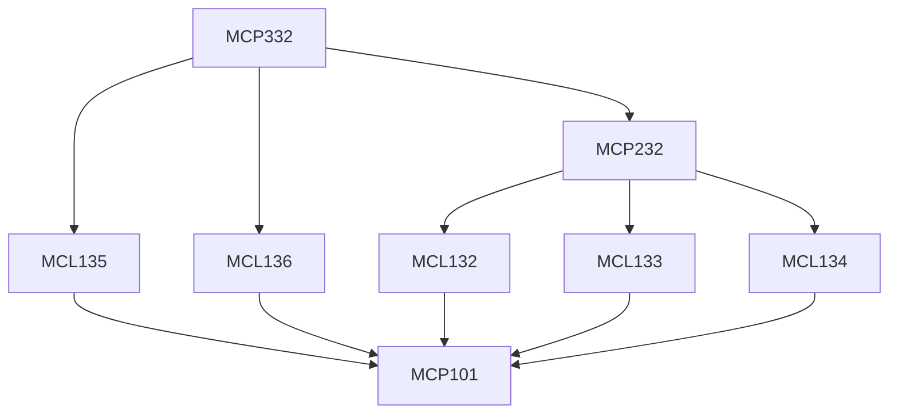

**Credits:** 1 (0-0-2)

**Prerequisites:** [[/Mechanical Engineering/MCL135 | MCL135]], [[/Mechanical Engineering/MCL136 | MCL136]], [[/Mechanical Engineering/MCP232 | MCP232]]

#### Description 
Experiments on machining and welding processes.

### Prerequisite Tree

