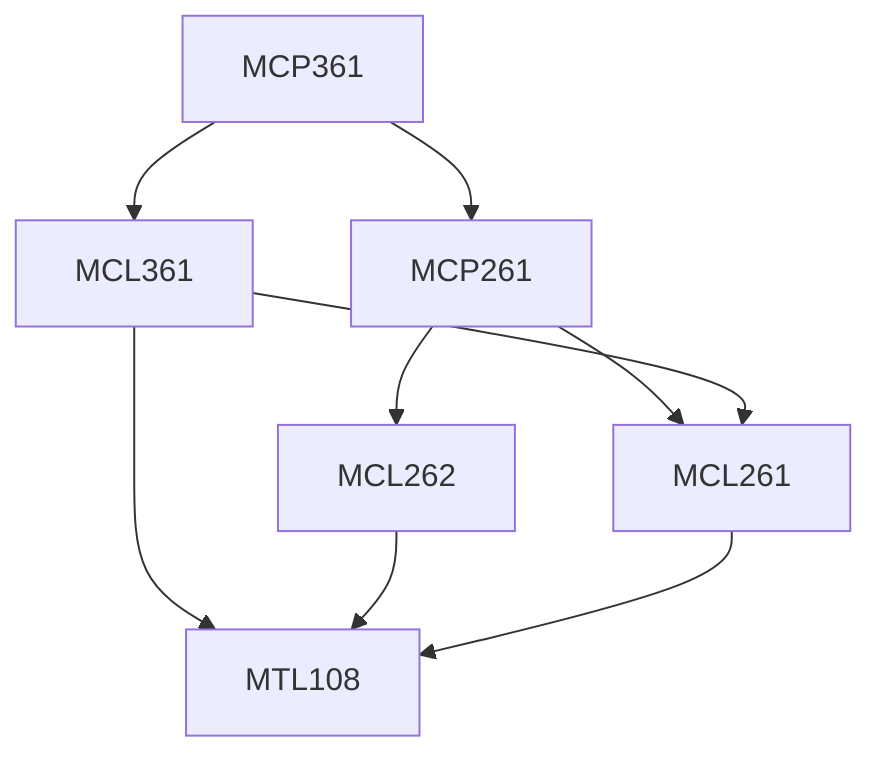

**Credits:** 1 (0-0-2)

**Prerequisites:** [[/Mechanical Engineering/MCP261|MCP261]], [[/Mechanical Engineering/MCL361|MCL361]]

#### Description
Design of optimal acceptance sampling plans, Design of optimal control charts, Simulation of process failures, Simulation of machine failures and Simulation of job shops and production lines with various production control mechanisms.

### Prerequisite Tree

