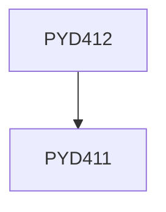

**Credits:** 8 (0-0-16)

**Prerequisites:** [[/Physics/PYD411|PYD411]]

#### Description
Open to only those students opting for Departmental Specialization. The Project can be a continuation of the project undertaken for PYD

411. The students will be eligible to do this project, if he/she secures a grade not below B in PYD411.

### Prerequisite Tree

