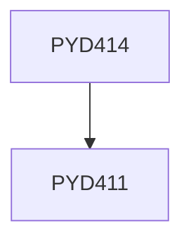

**Credits:** 4 (0-0-8)

**Prerequisites:** [[/Physics/PYD411|PYD411]]

#### Description
Working out the detailed work plan and implementation of the project. The Project can be a continunation of the project undertaken for PYD 411.

### Prerequisite Tree

