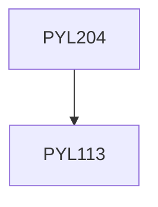

**Credits:** 4 (3-1-0)

**Prerequisites:** [[/Physics/PYL113|PYL113]]

#### Description
Introduction to the basic numerical tools, such as locating roots of equations, interpolation, numerical differentiation and integration, solutions of algebraic and differential equations, discrete Fourier transform, etc. Applications of Monte-Carlo simulations, optimization and variational methods etc. to problems of interest in multiple areas of Physics.

### Prerequisite Tree

